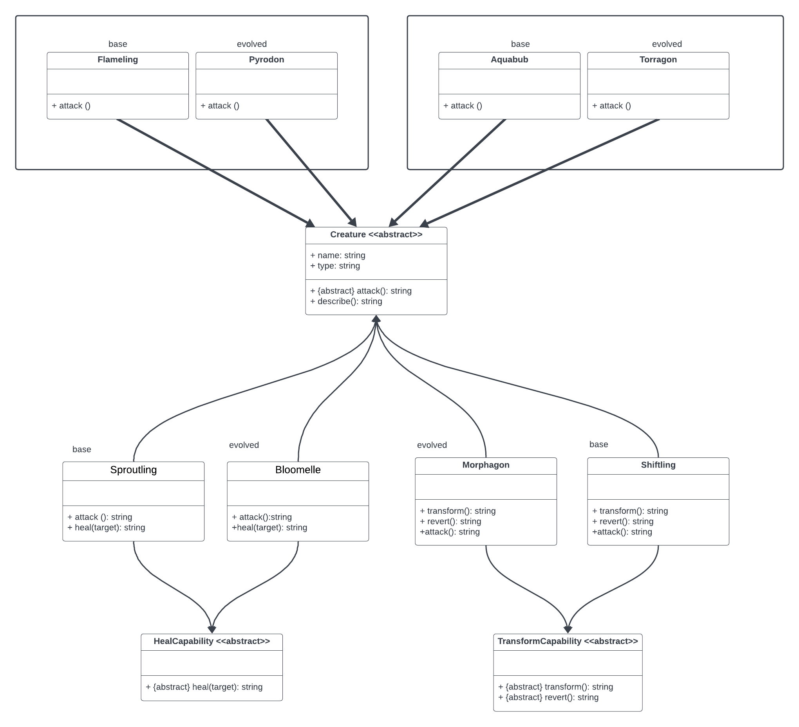
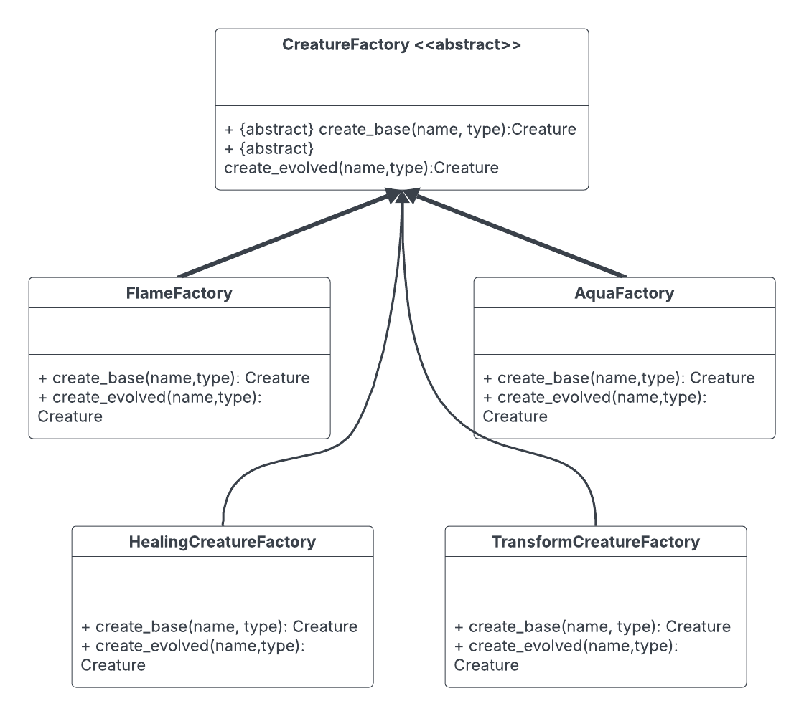
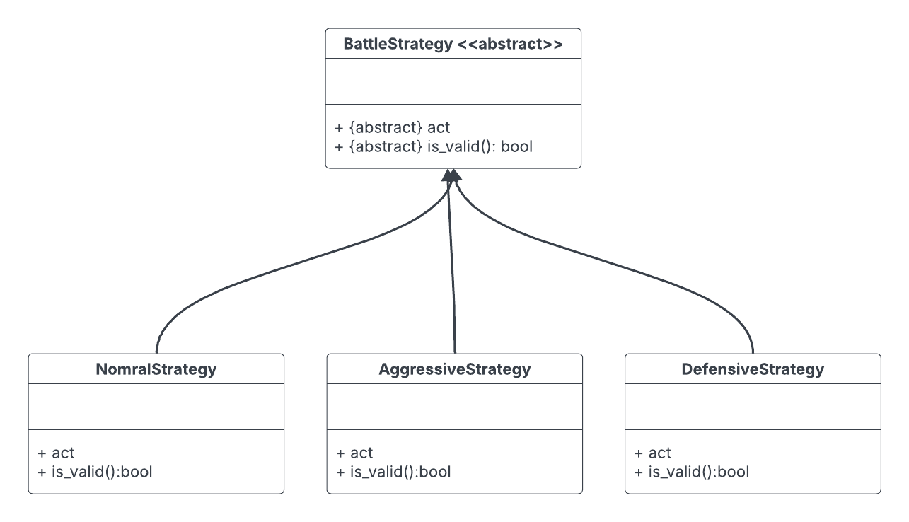

## DataDeck 

* This projects aims to design a creature-based card game inspired by popular monster-collecting
games. Your cards are not just static objects; they are dynamic data entities that can be grouped
into families, and that have capabilities used in a strategic way.

* But here’s the challenge: **how
do you create a system flexible enough to handle thousands of different card types while main-
taining clean, maintainable code?**

* The patterns that are used in this project are abstract factory and strategy design patterns.

--- 

- [Abstract factory explanation.](./doc/abstract_factory_pattern.md)
- [Strategy design pattern explanation.](./doc/startegy_design_pattern.md) 

---

## Class diagrams 
> Those are final diagrams not based on exercises .

* Creature class diagrams

* Abstract factory class diagram

* Strategy pattern class diagram

